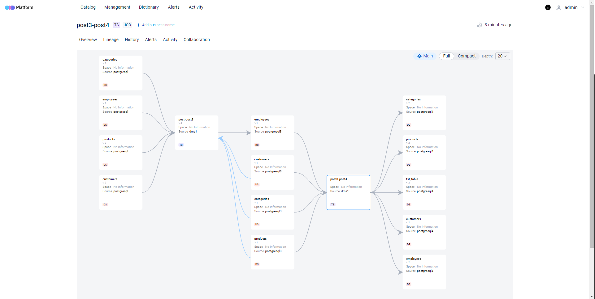

# AWS Database Migration Service Adapter

The DMS part of ODD provides clear dataflow visualization if AWS Database Migration Service is being used.
Each data migration is shown in the Lineage, which helps with an overall understanding of the migration process.
At the moment, supported data sources by ODD Collector for the DMS are:

<table>
    <thead>
        <tr>
            <th colspan="2">RDBMS</th>
        </tr>
    </thead>
    <tbody>
        <tr>
            <td>
            </td>
            <td><a href="https://github.com/opendatadiscovery/odd-collector#postgresql">PostgreSQL</a></td>
        </tr>
        <tr>
            <td> </td>
            <td><a href="https://github.com/opendatadiscovery/odd-collector#mysql">MySQL</a></td>
        </tr>
        <tr>
            <td> </td>
            <td><a href="https://github.com/opendatadiscovery/odd-collector#mssql">MSSQL</a></td>
        </tr>
        <tr>
            <td></td>
            <td><a href="https://github.com/opendatadiscovery/odd-collector#mariadb">MariaDB</a>
            </td>
        </tr>
    <thead>
        <tr>
            <th colspan="2">NoSQL</th>
        </tr>
    </thead>
        <tr>
            <td></td>
            <td><a href="https://github.com/opendatadiscovery/odd-collector#mongodb">MongoDB </a>
            </td>
        </tr>
    <thead>
        <tr>
            <th colspan="2">Storages</th>
        </tr>
    </thead>
        <tr>
            <td></td>
            <td><a href="https://github.com/opendatadiscovery/odd-collector-aws#s3">S3 </a></td>
        </tr>
</table>

## Sample of Lineage in UI:

## [Collector config example](../../../config_examples/dms.yaml) 

## For the future Amazon Aurora and Oracle should be implemented.
