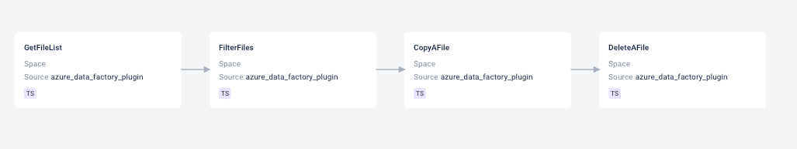

# Usage of Purview to generate pipeline

## Status

Rejected.

## Context

It was analyzed if Microsoft Purview would be useful in terms of gathering metadata in the ODD platform.

## Decision

Currently, it looks like Purview will not add additional value to the ADF adapter.  
Purview will not be used in the ODD, at least for now.

### Reasons

* It shows lineage only for single activities not for the whole pipelines.
* It's based on pipeline runs not on the definition itself, hence it shows lineage for each run. Because of that, the
  container or directory could change in each run.
* Lineage is shown "from file perspective", activities performed on a single file by different pipelines are shown in
  a single lineage.
* Using Purview brings additional cost for the user, and most of the metadata shown by Purview can be retrieved directly from
  ADF API, hence using Purview doesn't look profitable.

## Consequences

We will not get additional metadata from Purview.

# Adding datasets to the lineage

## Status

Proposed.

## Context

In the current shape, the Azure Data Factory (ADF) adapter shows only lineage between activities. For example:  
  
The platform isn't showing input and output files for each activity.
It was developed that way because inputs/outputs could be parametrized and because of that we can have different files for
each run, hence it isn't obvious how to show it in the lineage.

## Decision

The proposition is to show datasets between activities. For each activity, we should show input and output, in that case,
lineage
should look like this:  
`input1 -> task1 -> output1 -> task2 -> output2 -> ...`  
If files directories are hardcoded they can be shown directly in the lineage.  
It's yet to be decided how to show datasets that can change in each run.

## Consequences

Implementing this solution would greatly enhance the capabilities of ODD and its advantages over using ADF Studio directly.  
It would add a possibility to show the integration between ADF and different services (S3, Google Cloud Storage, etc) in the
platform. 