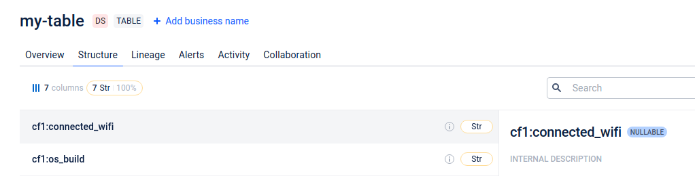

# BigTable Adapter
BigTable provides a wide-column NoSQL data model, allowing flexible schema design and easy horizontal scaling of the database.
There is no built-in API or method to directly retrieve data types or metadata for table columns. 
As a result, you will need to use the API to query the table rows and analyze the data.

## Configuration

- **name**: Name of the adapter (e.g. `bigtable`).
- **type**: Type of adapter (e.g. `bigtable`).
- **project**: Name of GCP project.
- **rows_limit**: Number of rows to get from each table (default to 10).

`rows_limit` is optional and is needed to retrieve N number on rows and their data types. 
The more rows you retrieve the more precise data types are.

## Hierarchy of API concepts
- a Client owns an Instance
- an Instance owns a Table
- a Table owns a ColumnFamily
- a Table owns a Row (and all the cells in the row)

Sample of data source oddrn:
`projects/open-data-discovery/instances/bigtable/tables/my-table`

#### Note:
On ODD Platform UI column families are specified along with column name.

## Views concept
In Google Cloud Bigtable, there is no concept of a traditional "view" as you might find in relational databases. 
Bigtable is a wide-column NoSQL database, and it doesn't support SQL queries or predefined views in the same way that relational databases do.
